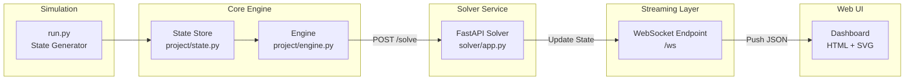
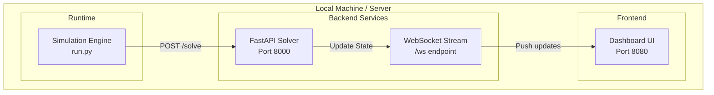

# 🏭 Ignition Digital Twin Starter Kit

A modern industrial architecture combining:

- ✅ State machine (Ignition-style logic)
- ✅ External solver (optimization engine)
- ✅ Real-time WebSocket streaming
- ✅ Web-based dashboard (SVG digital twin)
- ✅ Simulation environment

---

# 🚀 Quick Start

## 1. Install dependencies

```bash
pip install -r requirements.txt
```

## 2. Start the system

```bash
./start.sh
# OR
python start.py
```

## 3. Open dashboard

```
http://localhost:8080
```

---

# 🧠 Architecture Overview



---

# 🌐 Deployment Diagram



---

# 🔁 Data Flow

1. 🔄 Simulation updates machine state  
2. ⚙️ Engine sends state to solver  
3. 🧠 Solver updates global state  
4. 📡 WebSocket streams updates  
5. 🖥️ Dashboard updates SVG  

---

# ✅ Summary

You now have a complete real-time industrial system stack:

- Control logic
- Optimization
- Real-time streaming
- Live visualization
